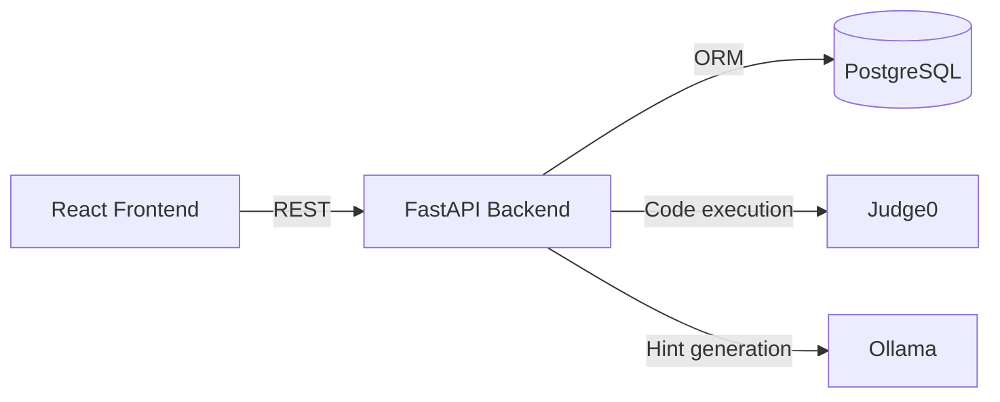

# AI Tutor Knowledge Transfer Guide

Last updated: April 6, 2026  
Primary codebase path: `/home/icfoss/ai tutor versions/AI_Tutor_1`

## 1. Project Purpose

AI Tutor is a full-stack coding practice platform where learners:
- Register or login with username/password.
- Solve coding problems in a browser-based Monaco editor.
- Validate code against sample and hidden tests (Judge0 execution).
- Submit final answers to update score, level, and concept mastery.
- Request level-aware AI hints (Ollama).

## 2. High-Level Architecture



Runtime ownership:
- Frontend app: `frontend/`
- Backend API: `backend/app.py`
- ORM + schema model definitions: `backend/models.py`
- Seed script for starter concepts/problems/tests: `backend/seed_data.py`

## 3. Repository Map

- `backend/app.py`: API routes, auth, recommendation, scoring, AI feedback.
- `backend/models.py`: SQLAlchemy models + DB session/init.
- `backend/seed_data.py`: Inserts 5 beginner concepts/problems/test cases.
- `frontend/src/App.jsx`: Main app state and page-level workflow.
- `frontend/src/services/api.js`: Frontend API contract.
- `run.sh`: Local orchestrator for backend + frontend.
- `README.md` and `QUICKSTART.md`: Quick setup docs.
- `PROJECT_WORKING.md` and `NEXT_QUESTION_RECOMMENDATION_WORKFLOW.md`: legacy internal docs.
- `codemastery_schema.sql` / `codemastery_full.sql`: database dumps (include some legacy tables not used by current backend code).

## 4. Local Setup and Boot

### 4.1 Prerequisites

- Python 3.10+
- Node.js 18+
- PostgreSQL instance + created database
- Judge0 reachable URL
- Ollama reachable URL

### 4.2 Install

```bash
# backend
cd backend
python3 -m venv venv
source venv/bin/activate
pip install -r requirements.txt

# frontend
cd ../frontend
npm install
```

### 4.3 Environment Variables

Backend (`backend/.env`):

```env
DATABASE_URL=postgresql+psycopg2://<user>:<password>@<host>:5432/<db_name>
JUDGE0_URL=http://<judge0-host>:2358
OLLAMA_URL=http://<ollama-host>:11434
JWT_SECRET=<unused_in_current_code>
JWT_ACCESS_TOKEN_EXPIRE_MINUTES=60
```

Frontend (`frontend/.env`):

```env
VITE_API_URL=http://localhost:8000
```

Notes:
- `JWT_SECRET` and `JWT_ACCESS_TOKEN_EXPIRE_MINUTES` exist in env, but JWT auth is not implemented in current code.
- Rotate secrets before sharing this project externally.

### 4.4 Seed Initial Content

```bash
cd backend
source venv/bin/activate
python seed_data.py
```

Important seed behavior:
- Concepts are inserted only if missing.
- Problems are inserted every run (not idempotent), so rerunning can duplicate problems/tests.

### 4.5 Start Services

Option A (preferred quick start):

```bash
./run.sh
```

Option B (manual):

```bash
# terminal 1
cd backend
source venv/bin/activate
uvicorn app:app --host 0.0.0.0 --port 8000

# terminal 2
cd frontend
npm run dev -- --host
```

Default local URLs:
- Frontend: `http://localhost:5173`
- Backend: `http://localhost:8000`

## 5. Backend Deep Dive

### 5.1 Core Responsibilities

`backend/app.py` handles:
- Startup DB initialization (`init_db()` on app startup).
- User auth (`/auth/register`, `/auth/login`).
- User progress and adaptive next-problem recommendation.
- Code execution (`/run`, `/validate`, `/submit`) via Judge0.
- Score/level updates and concept mastery updates.
- AI feedback (sync and streaming) via Ollama.

### 5.2 Security/Auth Status

Current state:
- Passwords hashed with PBKDF2-HMAC-SHA256 + random salt.
- No JWT session issuance.
- No route-level auth guard; APIs rely on provided `user_id`.
- CORS allows all origins.

Implication for transfer:
- Suitable for controlled/internal usage.
- For production, add token-based auth and authorization checks.

### 5.3 Recommendation Engine Summary

The next-problem recommendation combines:
- Allowed difficulties by learner level.
- Unsolved filtering.
- Concept mastery weakness signal.
- Retry encouragement for one failure.
- Stall/cooldown penalties for repeated failures.
- Progression fit using `order_index` anchor.
- Spacing bonus since last attempt.
- Minor tie-break using lower `order_index`.

Output includes:
- `next_problem`
- `reason` (human-readable scoring trace)
- `score`

### 5.4 Submission and Progression Logic

On `/submit`:
- Execute all tests for the problem.
- Save submission row.
- If first full pass for that user/problem:
  - `problems_solved += 1`
  - `total_score += score`
  - Level progression:
    - `beginner` -> `intermediate` at 5 solved
    - `intermediate` -> `expert` at 10 solved
    - `expert` -> `advanced` at 15 solved
- Update concept mastery:
  - pass: `+0.08`
  - fail: `-0.04`
  - clamp `[0.0, 1.0]`

## 6. Data Model (Current ORM Source of Truth)

Main tables mapped in `backend/models.py`:
- `users`
  - username, password_hash, current_level, total_score, problems_solved, created_at
- `problems`
  - title, description, difficulty, order_index, starter_code, hints (JSON), input/output format, concept_id
- `test_cases`
  - input_data, expected_output, sample/hidden flags, points
- `submissions`
  - user_id, problem_id, code, status, passed/total tests, score, submitted_at
- `concepts`
  - concept metadata for instruction and recommendation context
- `learner_concept_state`
  - per-user per-concept mastery score

Schema management note:
- Startup uses SQLAlchemy `create_all`.
- There is no migration framework in current code.

## 7. API Contract Summary

Health and capability:
- `GET /health`: backend + dependency health flags.
- `GET /languages`: proxy of Judge0 language list.

Auth and user:
- `POST /auth/register`
- `POST /auth/login`
- `GET /users/{user_id}`
- `GET /users/{user_id}/progress`
- `GET /users/{user_id}/next-recommendation`

Problems:
- `GET /problems`
- `GET /problems/{problem_id}`

Execution and scoring:
- `POST /run`: execute raw code/stdin without scoring persistence.
- `POST /validate`: execute all problem tests, no DB write.
- `POST /submit`: execute all tests + save submission + update progress/mastery.

AI hints:
- `POST /feedback`: non-streamed response.
- `POST /feedback/stream`: streamed text chunks.

## 8. Frontend Deep Dive

`frontend/src/App.jsx` orchestrates:
- Login/register flow and local auth state.
- Progress load and automatic recommended-problem load.
- Code draft persistence per problem via localStorage keys:
  - `auth-user`
  - `theme`
  - `code-save-{problemId}`
- Validate, submit, and hint actions.
- Sidebar and results panel resizing behavior.

`frontend/src/services/api.js` provides:
- Thin wrappers for all backend endpoints.
- Streaming feedback fallback to non-stream endpoint if `/feedback/stream` returns 404.

## 9. Operational Runbook

### 9.1 Day-1 Validation Checklist

- Confirm DB connection by starting backend (`uvicorn`) successfully.
- Verify `GET /health` returns `backend: ok`.
- Verify `judge0` and `ollama` statuses are `ok` in health response.
- Register a new user and solve one seeded problem.
- Confirm submission writes in DB and progress increments.

### 9.2 Common Failure Modes

- `DATABASE_URL` wrong or DB offline:
  - backend startup fails or requests error.
- Judge0 unavailable:
  - `/run`, `/validate`, `/submit`, `/languages` fail.
- Ollama unavailable:
  - `/feedback`, `/feedback/stream` fail.
- Seed script rerun:
  - duplicate problems due to non-idempotent problem insert logic.

### 9.3 Data Backup / Restore

Existing SQL dumps:
- `codemastery_schema.sql`: schema-only style dump.
- `codemastery_full.sql`: schema + data style dump.

Recommendation:
- Treat ORM (`backend/models.py`) as active application schema source.
- Use dump files for recovery/reference, not as guaranteed exact reflection of current app behavior.

## 10. Change Guide (Where to Edit What)

- Add/update API route logic: `backend/app.py`
- Change DB entities or relationships: `backend/models.py`
- Add default learning content: `backend/seed_data.py`
- Modify recommendation algorithm: `build_problem_recommendation` in `backend/app.py`
- Modify level-up thresholds or mastery deltas: `submit_solution` + `update_concept_mastery` in `backend/app.py`
- Change frontend workflow/state: `frontend/src/App.jsx`
- Change API request wrappers: `frontend/src/services/api.js`
- Change visual components:
  - Header: `frontend/src/components/Header.jsx`
  - Problem panel: `frontend/src/components/ProblemSidebar.jsx`
  - Editor: `frontend/src/components/CodeEditor.jsx`
  - Results/hints UI: `frontend/src/components/ResultsPanel.jsx`

## 11. Known Gaps and Technical Debt

- No automated test suite currently committed.
- No migration tooling (`alembic` not configured).
- No JWT/session auth even though env contains JWT keys.
- CORS is wildcard.
- `run.sh` Ollama prompt suggests pulling `qwen2.5-coder:3b`, while backend uses `qwen2.5-coder:14b`; align this before production handoff.
- SQL dump files include legacy tables (`ai_feedback_logs`, `diagnostic_logs`, `errors`) not mapped in current ORM.

## 12. Knowledge Transfer Session Checklist

Use this during handover to a new owner:

1. Walk through architecture and external dependencies.
2. Run local setup end-to-end on the new machine.
3. Explain auth flow and current security limitations.
4. Explain submission scoring, level progression, and mastery updates.
5. Explain recommendation scoring factors and how to tune them.
6. Demo streaming feedback flow and fallback behavior.
7. Show where to add new problems and concepts safely.
8. Review known gaps and pick next hardening tasks.
9. Share DB backup/restore process.
10. Assign ownership for backend, frontend, infrastructure, and QA.
